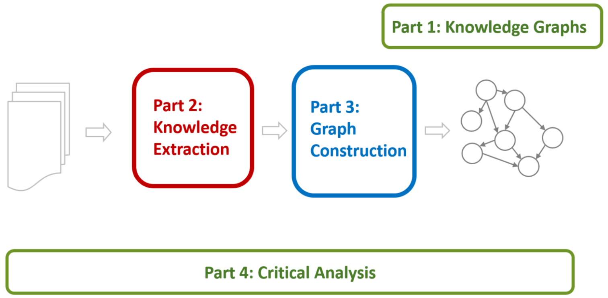

## Knowledge Graph Construction From Text

### Jay Pujara, Sameer Singh, Bhavana Dalvi

With the proliferation of large collections of unstructured text, the problem of extracting structured knowledge and integrating it into a coherent knowledge graph has become increasingly important.
Applications that rely on structured knowledge representations include digital assistants (Siri, Alexa, Cortana, and Google Now), question answering, summarization, and as well as many downstream autonomous decision-making.
Due to its importance, this area has been an active area of research spanning areas of natural language processing, information extraction, information integration, databases, search, and machine learning.

<!--
The variety and complexity of the available scholarly work, however, makes it difficult for a newcomer to familiarize themselves with the field.
Knowledge graph construction has been decomposed into a large number of inter-dependent and sometimes overlapping tasks, such as the traditional natural language processing, semantic parsing, entity extraction, entity disambiguation and linking, identification and classification of relations, and completion of the knowledge graph.
The kinds of machine learning approaches have also been quite varied, ranging from classification/clustering, probabilistic graphical models, probabilistic logic formulations, matrix/tensor factorization-based approaches, and more recently, deep learning.
There are also a plethora of existing systems that have been proposed, including from top universities such as Stanford (DeepDive), Carnegie Mellon (NELL), University of Washington (OpenIE), Mannheim (DBpedia), and the Max Planck Institut Informatik (YAGO, WebChild) among others.
This diverse and fragmented literature poses a significant roadblock for newcomers to contribute to the field.

We are designing our tutorial to address this barrier.
-->

Our goal is to present an accessible and structured overview of the existing approaches to extracting candidate facts from text and incorporating these into a well-formed knowledge graph. Our approach includes identifying the common themes and challenges in the area, and comparing and contrasting the existing approaches on the basis of these aspects.
We believe such a unifying framework will provide the necessary tools and perspectives to enable the newcomers to the field to explore, evaluate, and develop novel techniques for automated knowledge graph construction.

## Outline (with draft slides)

#### Part 1: Knowledge Graph Primer

#### Part 2: Knowledge Extraction from Text

- NLP Fundamentals
- Information Extraction

**Coffee Break**

#### Part 3: Knowledge Graph Construction

- Probabilistic Models
- Embedding Techniques

#### Part 4: Critical Overview and Conclusion
