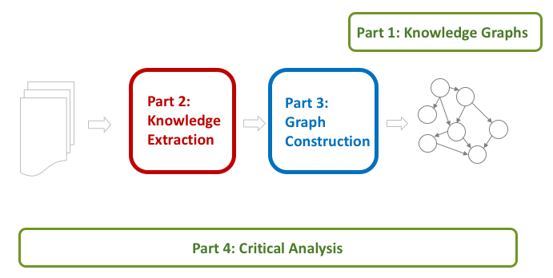

## Mining Knowledge Graphs from Text

#### WSDM 2018 Tutorial <a href="http://www.wsdm-conference.org/2018/tutorials.html">(schedule)</a>

#### February 5, 2018, 1:30PM - 5:00PM

#### Location: Ballroom Terrace (The Ritz-Carlton, Marina del Rey)

### [Jay Pujara](https://www.jaypujara.org/), [Sameer Singh](http://sameersingh.org/)

Knowledge graphs have become an increasingly crucial component in machine intelligence systems, powering ubiquitous digital assistants and inspiring several large scale academic projects across the globe. Our tutorial explains why knowledge graphs are important, how knowledge graphs are constructed, and where new research opportunities exist for improving the state-of-the-art. 
In this tutorial, we cover the many sophisticated approaches that complete and correct knowledge graphs. We organize this exploration into two main classes of models. The first include probabilistic logical frameworks that use graphical models, random walks, or statistical rule mining to construct knowledge graphs. The second class of models includes latent space models such as matrix and tensor factorization and neural networks. 
We conclude the tutorial with a critical comparison of techniques and results. We will offer practical advice for novices to identify common empirical challenges and concrete data sets for initial experimentation. Finally, we will highlight promising areas of current and future work.

<!--
The variety and complexity of the available scholarly work, however, makes it difficult for a newcomer to familiarize themselves with the field.
Knowledge graph construction has been decomposed into a large number of inter-dependent and sometimes overlapping tasks, such as the traditional natural language processing, semantic parsing, entity extraction, entity disambiguation and linking, identification and classification of relations, and completion of the knowledge graph.
The kinds of machine learning approaches have also been quite varied, ranging from classification/clustering, probabilistic graphical models, probabilistic logic formulations, matrix/tensor factorization-based approaches, and more recently, deep learning.
There are also a plethora of existing systems that have been proposed, including from top universities such as Stanford (DeepDive), Carnegie Mellon (NELL), University of Washington (OpenIE), Mannheim (DBpedia), and the Max Planck Institut Informatik (YAGO, WebChild) among others.
This diverse and fragmented literature poses a significant roadblock for newcomers to contribute to the field.

We are designing our tutorial to address this barrier.
-->

Our goal is to present an accessible and structured overview of the existing approaches to extracting candidate facts from text and incorporating these into a well-formed knowledge graph. Our approach includes identifying the common themes and challenges in the area, and comparing and contrasting the existing approaches on the basis of these aspects.
We believe such a unifying framework will provide the necessary tools and perspectives to enable the newcomers to the field to explore, evaluate, and develop novel techniques for automated knowledge graph construction.

## Outline (with draft slides)

### Part 1: Knowledge Graph Primer \[ [Slides](wsdm-slides/Part1_Intro.pdf) \]
- What is a Knowledge Graph?
-	Why are Knowledge Graphs Important?
-	Where do Knowledge Graphs come from?
-	Knowledge Representation Choices
-	Problem Overview
 

### Part 2: Knowledge Extraction Primer \[ [**Slides**](wsdm-slides/Part2_KE.pdf) \]
- NLP Fundamentals (tagging, parsing, named entity recognition and entity resolution)
- Learning knowledge extractors
- Scoring extracted knowledge
- Categories of IE techniques
- Compositional models: Knowledge fusion 

#### Coffee Break

### Part 3: Knowledge Graph Construction
- Graph construction overview
- Probabilistic Models \[ [**Slides**](wsdm-slides/Part3a_Prob.pdf) \]
  - Motivation
  - Graphical models
  - Random walk approaches
- Embedding Techniques \[ [**Slides**](wsdm-slides/Part3b_Embds.pdf) \]
  - Relation extraction techniques
    - Matrix factorization 
    - Embedding entity pairs
  - Graph completion techniques
    - Tensor factorization
    - Entity and relation embeddings
    - Compositional models

### Part 4: Critical Overview and Conclusion \[ [Slides](wsdm-slides/Part4_Summary.pdf) \]
- Summary                   
- Success stories       
- Datasets, tasks, softwares   
- Exciting active research    
- Future research directions    
